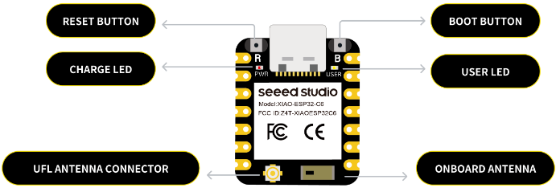

# ESP32BattSensor
This is to build a simple weather station to be used for home automation. The project is build for Home Assistant but the ZigBee code can be used generic.
This is how I have set up my Weather station data

There is 2 software versions:
- a ESPHome WiFi based (uses a lot of power)
- a ZigBee version that uses sleep.. Much better with battery life.

## Hardware
This is based on a ESP32C6 from Seeed Studio and a BME280 sensor fro Temperature, Humidity and Barometric pressure.

## ZigBee
### Arduino project setup
Clone repository, and open the ird file.
In the Arduino UI set the following 
* Before Compile/Verify, select the correct board: `Tools -> Board` - **XIAO ESP32c6**
* Select the End device Zigbee mode: `Tools -> Zigbee mode: Zigbee ED (end device)`
* Select Partition Scheme for Zigbee: `Tools -> Partition Scheme: Zigbee 4MB with spiffs`
* Select the COM port: `Tools -> Port: xxx` where the `xxx` is the detected COM port.
* Optional: Set debug level to verbose to see all logs from Zigbee stack: `Tools -> Core Debug Level: Verbose`.

If you have changed any of the pins (Battery and the SLC bus). Also if you are using another ESP32c6 then check accordantly.

Open compile and upload the code to the ESP32c6.. 

### Connecting the first time
The sensor will be in paring mode when  

### Reset to factory
If the device is already registered in a home automation -- delete this entry..

To reset connection do the following on the ESP32:
<ol>
  <li>Reset (button) & after Boot button -- IMPORTANT! Du not use a metal object to push the buttons, it can damage the device if you touches any other terminal on the board. Use a plastic or a nail if your finger is to big to get to the tiny button </li>
  <li>Wait until the yellow light (User led) Is solid</li>
  <li>Wait 5 seconds then reset the device and start the search as above</li>
</ol>
